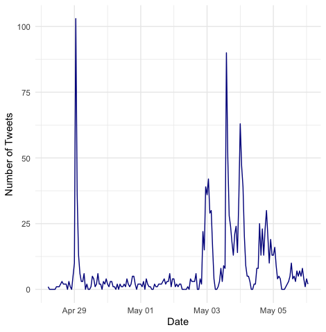
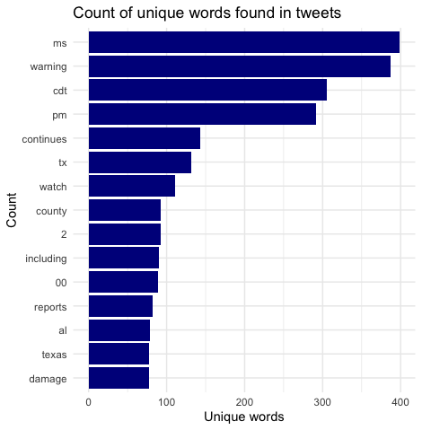
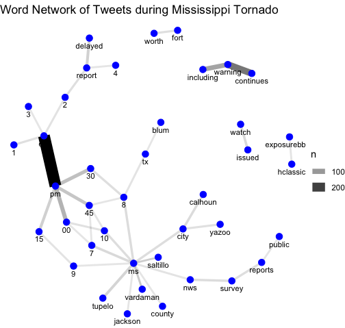
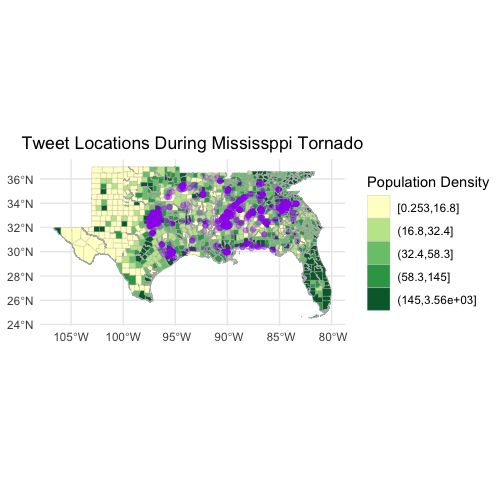
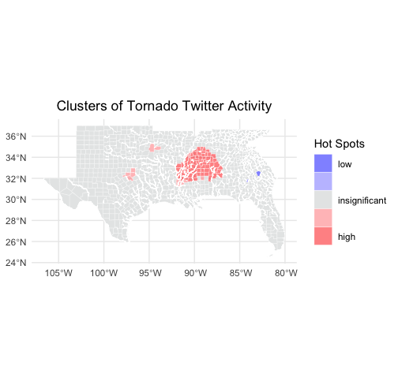

**Replication of**
# Spatial, temporal and content analysis of Twitter data

Original study *by* Wang, Z., X. Ye, and M. H. Tsou. 2016. Spatial, temporal, and content analysis of Twitter for wildfire hazards. *Natural Hazards* 83 (1):523–540. DOI:[10.1007/s11069-016-2329-6](https://doi.org/10.1007/s11069-016-2329-6).
and
First replication study by Holler, J. 2021 (in preparation). Hurricane Dorian vs Sharpie Pen: an empirical test of social amplification of risk on social media.

Replication Author: Sanjana Roy

Replication Materials Available at: [RE-Dorian](RE-Dorian)

Created: `22 May 2021`
Revised: `23 May 2021`

## Abstract

Wang et al. (2016) analyzed Twitter data for wildfires in California, finding that the social media data are useful in framing the spatial and temporal extents of wildfire events, providing useful information on disaster situations. The study found that social media data are able to track real-time hotspots and risks posed by wildfire events and that news and local media authorities play a large role in the retweet network in influencing the distribution of information, providing implications for emergency response and management as well as public situational awareness. Holler (2021) is studying Twitter data for Hurricane Dorian on the Atlantic coast, finding that in spite of tending news and social media content regarding a false narrative of risk, original Tweets still clustered significantly along the real hurricane track, and only along the hurricane track.

Reproducing and replicating spatial research of Twitter data during natural disasters continues to be relevant because it unearths patterns of human communication that respond differently to different disaster scenarios. Due to the nature of online data constantly being deleted or modified, it is difficult to conduct replication studies that prove previous results. However, reproduction studies using different data and applied to different scenarios allows us to observe these patterns. The role of social media during disasters is constantly evolving and is important to study due to the influence it has in communication during difficult times and people's reliance on the information it disseminates.

In his replication study, I will analyse the spatial distribution of tweets during the tornado occurring from April 28, 2021 to May 5, 2021 in the Southern states of the USA, and specifically in Mississippi.


## Original Study Information

**summarize Wang et al (2016) similar to the Holler (2021) summary below**

Holler (2021) loosely replicated the methods of Wang et al (2016) for the case of Hurricane Dorian's landfall on the U.S. mainland during the 2019 Atlantic Hurricane season. Wang et al.'s (2016) data was based on Twitter Search API queries for 'fire' and 'wildfire' and then further focused on the specific wildfires in 'Bernado' and 'San Marcos' during the time period of May 13, 2014 to May 22, 2014. The geographical extent of this twitter data was set at a radius of 40 miles from San Diego County. The authors conducted an analysis identifying important terms and term clusters, using k-means method of clustering, and found that the majority of tweets focused on the need to evacuate or the current state of fires and extent of damage caused in homes. A social network analysis was also conducted based on retweet relationships identified in the data, finding that local news media have a large impact on the social media network and the distribution of information. Lastly, the authors also used dual kernel density estimation (dual KDE) to map the spatial patterns of tweets associated with the two specific wildfires in Bernado and San Marcos and found that tweet locations largely corresponded with the locations of wildfires.

Holler modified Wang et al's methods by not searching for retweets for network analysis, focusing instead on original Tweet content with keywords hurricane, Dorian, or sharpiegate (a trending hashtag referring to the storm). Holler modified the methodology for normalizing tweet data by creating a normalized Tweet difference index and extended the methodology to test for spatial clustering with the local Getis-Ord statistic. The study tested a hypothesis that false narratives of hurricane risk promulgated at the highest levels of the United States government would significantly distort the geographic distribution of Twitter activity related to the hurricane and its impacts, finding that original Twitter data still clustered only in the affected areas of the Atlantic coast in spite of false narratives about risk of a westward track through Alabama.

Wang et al (2016) conducted their study using the `tm` and `igraph` packages in `R 3.1.2`. It is unknown what GIS software was used for spatial analysis, however, the authors do give credit to ESRI, suggesting the use of ArcGIS. The replication study by Holler (2021) used R, including the rtweet, rehydratoR, igraph, sf, and spdep packages for analysis. This replication study uses the same packages and code as Holler (2021) with the use of different data along with certain modifications in the code.

## Materials and Procedure

Outline the data to be used in your replication study, including:

- twitter search parameters
- attach / link to files containing status_id's for the search results
- any data used to normalize the tweets
- methods for analysis / synthesis

This analysis began by searching the Twitter database using the keywords 'tornado' and 'storm' within 300 miles of Jackson, Mississippi (32, -90). The time frame used for this analysis was April 29th, 2021 to May 5th, 2021. This search rendered a dataframe of 20296 observations. [Here](data/raw/public/Misstornadoids.txt) are the status_ids that can be used to recover the original tweets. A control or baseline (limited with the same number of observations as the tornado data) search without any keywords was also conducted, rendering 35998 observations whose status_id's can be found [here](data/raw/public/Missbaselineids.txt). Retweets were excluded from both searches in order to attain a more concentrated set of tweets. After filtering the data for tweets only within the designated place_type's of city, neighbourhood, and poi and with coordinates, the observations for the tornado tweets were 1480 while the baseline tweets were 2255.

This analysis also later normalized the tweet data using county-level population data from the U.S. Census Bureau in order to attain the tweet rate per 1000 population. The counties that were used in this analysis were from states including Mississippi and any bordering states as well: Alabama, Arkansas, Florida, Georgia, Louisiana, Oklahoma, Tennessee, and Texas. [Here](data/derived/public/Surround_counties.RDS) is a link to the census data with the selected states.

Below is a workflow of the methodology used for this analysis. The code behind this can be found [here]().
1. Tweets using keywords and baseline tweets were filtered for based on place_type and presence of geo-coordinates
2. A temporal analysis of tornado tweets by hour for the time period of seven days was conducted using the package 'rtweet'
3. A textual analysis of the tornado tweets was conducted by filtering the tweet content for stop words (using the existing R stop_words documentation) and graphing the frequency of the top 15 words present in all the tweet content
4. A second textual analysis was conducted by identifying word pairs in the tornado tweet content and presenting this in a word cloud using the 'ggraph' package
5. Spatial analysis involved acquiring census population data and geometry of selected states and plotting a choropleth map showing population density by county layered with tweet point data using the 'ggplot2' package
6. Tweets were grouped by county and summarised for the number of tweets. Tweet rates per 10,000 in population were calculated as well as the "Normalized Tweet Difference," using the formula (tornado - base)/(tornado + base)
7. Tornado tweets and baseline tweets were transformed into point data and the CRS NAD 1983 (4269) and were joined to county data by GEOID
8. Data was then grouped by county and identified for which counties were within 110 kilometers of one another. A weight matrix was then created from these nearest neighbour objects
9. The Getis-Ord G* statistic was used to identify hot and cold spots of twitter data
10. G* scores were classified by their significance values at the p<0.125 and p<0.05 two-tailed confidence levels. These hot and cold spots were then mapped

CITE CITATIONS IN CODE

## Replication Results


Figure 1.


Figure 2.


Figure 3.


Figure 4.


Figure 5.


Figure 6.

- Add county boundaries to maps

## Unplanned Deviations from the Protocol

Summarize changes and uncertainties between
- your expectation of a reproduction workflow based on the reading and Dorian analysis
- your final workflow after completing the lab

The analysis did not include any significant changes from the code and methodology produced by Holler (2021). Minor changes were made in the number of baseline tweets that were pulled from Twitter, which were based on the number of tornado tweets obtained. The word pairs network also used a lower count of 12 instead of 30 to graph the word cloud, according to the smaller set of data obtained. Certain map parameters were adjusted for better visualization and clearer labelling of graphs, and a map showing the "Normalized Tweet Difference" was also created. Bot data was analysed using the following code:

```r
tornado <- tornado %>%
  mutate(bots = ifelse(source %in% c("Twitter for iPhone", "Twitter for Android", "Instagram", "Tweetbot for IOS"),
                       "not a bot",
                       "bot"))
```

## Discussion

Provide a summary and interpretation of your key findings in relation to your research question. Mention if findings confirm or contradict patterns observed by Wang et al (2016) or by Holler (2021)


Figure 7. Thanks to Emma Clinton for the source I saw on her blog

Similar to the findings of Wang et al. (2016), the observed twitter activity surrouding tornados largely corresponded with the eastward movement of tornado activity from the period of April 29th to May 5th. Figure 1 shows peaks of tornado-related twitter activity on April 29th and from May 3rd to May 5th. The data that was obtained was concentrated in Mississippi with tweets from surrounding states included in the 300 miles stemming from Jackson, MI. The 29th of May showed tornado activity present in Texas and not Mississippi, and therefore, peaks in tornado-related tweets would have been from areas of Texas that fell within the mile radius, such as Dallas, TX. However, during the period of May 3rd to May 5th, tornado activity peaked for many of the Southern belt of states, including Mississippi, (Figure 7) explaining the trends in Figure 1 during this time period.

The analysis of unique words found that the most number of words used by tweets in the area involved the use of 'ms', indicating the state, as well as 'warning', 'cdt' (Central Daylight Time), and 'pm'. All of these words indicate the use of warning messages and alerts that were spread to inform people on the weather status and where and when tornados would be affecting the area. A majority of the tweets that were issued during this time period were bot-created tweets by weather channels or national weather services (Figure ...). Similar to the findings of Wang et al. (2016), these media-like accounts tend to dominate the twitter network during a disaster and are highly influential in the spread of information, at times preventing smaller occurrences and personal experiences to come to the fore. Although this reproduction did not involve the use of retweets, the data still indicates the influential role they played and the extent to which they dominate overall tweet content. However, this large presence in the data may also speak to the inability of people to access online platforms simply due to the nature of a disaster occurring or due to the fact that there may be power outages and infrastructural damage. These factors introduce uncertainty in the transformation of real-world phenomenon into data that can be analysed.

Figure 3 demonstrates similar findings to Figure 2, indicating the times at which the tornados were to occur, which were mostly likely spread by weather channels. These seem to mostly be occuring during the night, as identified during the disaster as well, when people would be asleep and not active online leading to a delayed response in twitter activity following the disaster. The word pairings also reveal some of the counties and cities in Mississippi that were largely affected by the tornados: Calhoun (Vardaman - 43 homes affected), Yazoo (76 homes affected), and Lee counties (Tupelo and Saltillo - 76 homes affected). The graph also involves the towns of Fort Worth and Blum in Texas, which would have been included in the mile radius from Jackson, MI.


According to [weather data](wikipedia)  

Figure 5 shows a clustering of activity around the


- *Twitter Activity corresponds with the tornados that hit at different times across the South and Mississippi*
- *Eastward movement of tornado activity*
- *Cities most affected and comparison in word map*
- Kernel density would maybe be better? Wang et al.
- Could not separate differentiated clusters within Mississippi - comparison with other people who looked at tornado data
- *Analysis of bots - separating colors in point map of twitter locations*
- *Power outages to consider -- adding to uncertainty*
- Tornados are less predictable
- much of the data is not associated with geocoordinates

## Conclusion

Restate the key findings and discuss their broader societal implications or contributions to theory.
Do the research findings suggest a need for any future research?

## References

Include any referenced studies or materials in the [AAG Style of author-date referencing](https://www.tandf.co.uk//journals/authors/style/reference/tf_USChicagoB.pdf).

####  Report Template References & License

This template was developed by Peter Kedron and Joseph Holler with funding support from HEGS-2049837. This template is an adaptation of the ReScience Article Template Developed by N.P Rougier, released under a GPL version 3 license and available here: https://github.com/ReScience/template. Copyright © Nicolas Rougier and coauthors. It also draws inspiration from the pre-registration protocol of the Open Science Framework and the replication studies of Camerer et al. (2016, 2018). See https://osf.io/pfdyw/ and https://osf.io/bzm54/

Camerer, C. F., A. Dreber, E. Forsell, T.-H. Ho, J. Huber, M. Johannesson, M. Kirchler, J. Almenberg, A. Altmejd, T. Chan, E. Heikensten, F. Holzmeister, T. Imai, S. Isaksson, G. Nave, T. Pfeiffer, M. Razen, and H. Wu. 2016. Evaluating replicability of laboratory experiments in economics. Science 351 (6280):1433–1436. https://www.sciencemag.org/lookup/doi/10.1126/science.aaf0918.

Camerer, C. F., A. Dreber, F. Holzmeister, T.-H. Ho, J. Huber, M. Johannesson, M. Kirchler, G. Nave, B. A. Nosek, T. Pfeiffer, A. Altmejd, N. Buttrick, T. Chan, Y. Chen, E. Forsell, A. Gampa, E. Heikensten, L. Hummer, T. Imai, S. Isaksson, D. Manfredi, J. Rose, E.-J. Wagenmakers, and H. Wu. 2018. Evaluating the replicability of social science experiments in Nature and Science between 2010 and 2015. Nature Human Behaviour 2 (9):637–644. http://www.nature.com/articles/s41562-018-0399-z.
