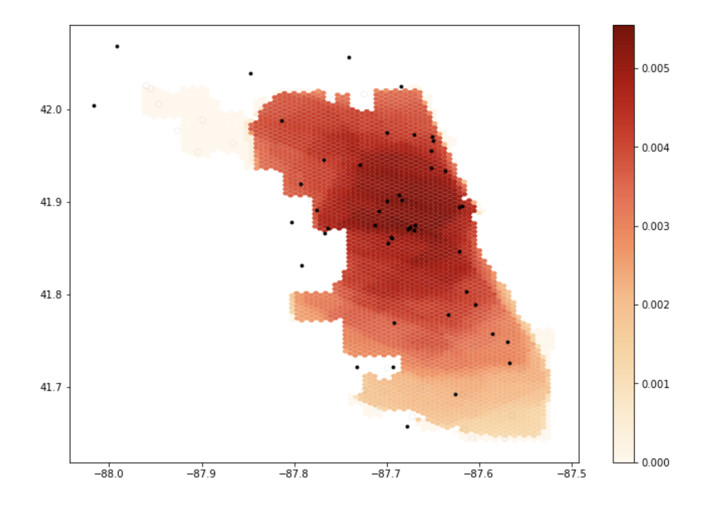
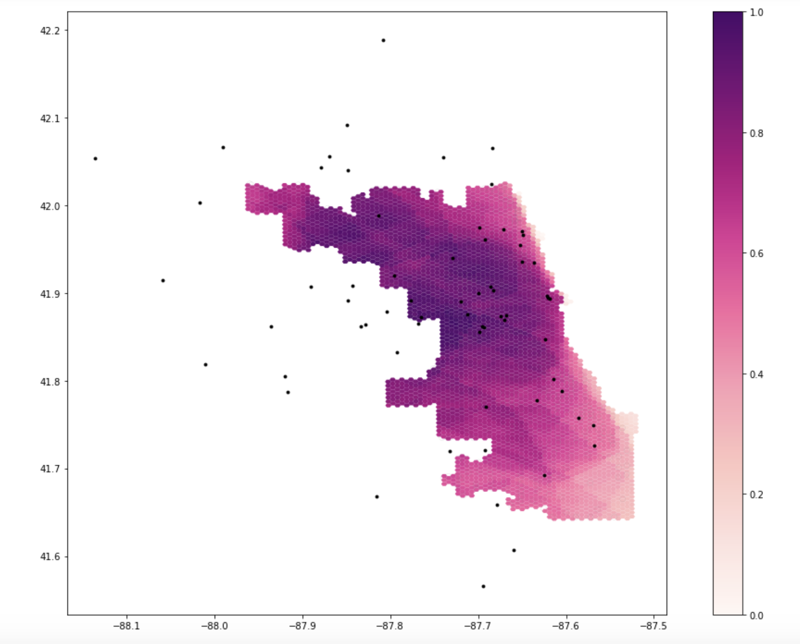
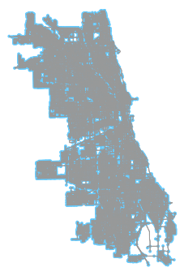
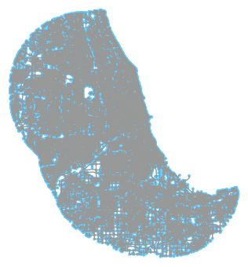

**Reproduction of Spatial Accessibility of COVID-19 Healthcare Resources**

Original study *by* Kang, J. Y., A. Michels, F. Lyu, Shaohua Wang, N. Agbodo, V. L. Freeman, and Shaowen Wang. 2020. Rapidly measuring spatial accessibility of COVID-19 healthcare resources: a case study of Illinois, USA. *International Journal of Health Geographics* 19 (1):1–17. DOI: [10.1186/s12942-020-00229-x](https://ij-healthgeographics.biomedcentral.com/articles/10.1186/s12942-020-00229-x)

Reproduction Author: Sanjana Roy and the OpenSource GIScience students of Spring 2021

Reproduction Materials Available at: [Forked RP-Kang Repository](github repository link)

Created: `19 May 2021`
Revised: `25 May 2021`


## Introduction

The onset of the COVID-19 pandemic fueled a global need for accessible healthcare resources. The constant and exponential increase in patients has put immense pressure on hospitals and healthcare providers to cater to as many people as possible. However, these resources are often unavailable to many, both in terms of their spatial locations and financial constraints, creating vast inequalities in how people are treated for the virus as well as other illnesses. Kang et al. (2020) attempts to understand the spatial accessibility of COVID-19 healthcare resources in Illinois, USA. This study was conducted using CyberGISX in order to compute this analysis and produce outcomes that could be available for decision-making. The code behind this analysis was made available through Jupyter Notebooks, allowing for easy replication and reproduction of the study by other researchers, such as ourselves. This contribution by Kang et al. (2020) takes a large step in making research available in the OpenSource world, where analyses concerning such important and relevant topics can be critiqued and enhanced through testing and editing by other researchers, making for a more robust methodology that can be applied to other contexts.


## Materials and Methods

[Here is a link to the original code]()

Kang et al. (2020) utilized four different data sources for this analysis:
1. **Hospital dataset** including number of beds in ICUs and number of ventilator units per hospital - provided by the [Illinois Department of Public Health (IDPH)](https://hifld-geoplatform.opendata.arcgis.com/datasets/hospitals/explore)
2. **COVID-19 confirmed cases dataset** at the zip code level - provided by IDPH
3. **Residential dataset** by census tract in Illinois - accessed using API to pull from the [US Census Bureau American Community Survey (2018 - 5-year detail)](https://data.census.gov/cedsci/deeplinks?url=https%3A%2F%2Ffactfinder.census.gov%2F&tid=GOVSTIMESERIES.CG00ORG01)
4. **Road network dataset** - retrieved using [OSMnx](https://github.com/gboeing/osmnx) python package from OpenStreetMap

Hospitals that were military, children, psychiatric, or rehabilitation facilities were excluded and hospitals within a 15 miles of the Chicago boundary were included. The CDCs Social Vulnerability Index (SVI) was used to acquire the number of people aged 50 and older to examine vulnerability characteristics in relation to low and high accessibility of hospital resources. Kang et al. (2020) used the roads network and hospitals to identify nodes in the network that were closest to hospitals, attaching hospitals along with their data to the nearest network node. Nodes with zero outdegree or under 10 nodes were removed to prevent the formation of smaller egocentric networks. The max driving speed for the roads was set at 35 miles per hour. Population centroids and hosptial catchment areas are then created. The conventional two-step floating catchement area method (2SFCA) was used and further developed into a Parallel enhanced 2SFCA (P-E2SFCA) in order to calculate the service-to-population (ICU beds/ventilators to population) ratio of a hospital zone while accounting for distance decay by allowing for multiple travel time zones, creating a convex hull with subdivisions around each node: 0-10, 10-20, 20-30 mins. These travel time zones were weighted (1, 0.68, and 0.22 respectively) and overlapping zones in residential locations were summed together. These accessibility measurements are then aggregated into hexagon grids (to reduce edge effects).

### Changes made to Original Code

[Here is the link to the updated and revised code]()

A major inaccuracy in the code stemmed from the boundary effects of this analysis. Nodes that were created near the edges of Chicago had hospitals outside of Chicago (but within 15 miles) attach to these nodes, overestimating the number of beds or ventilators that would be accessible to people in that area. Since the road network only extended to the boundaries of Chicago, travel-time distance was not accounted for. Therefore, the first change that was made in the code was to extend the road network around 30 km (larger than 15 miles), using a buffer, outside of Chicago so that hospitals would not be unevenly spatially distributed. Here are the changes out class collaboratively made to the code:

``` python
if not os.path.exists("data/Chicago_Network_Buffer.graphml"):
    #ambiguous place names but would need to look into OSM connection with API
    G = ox.graph_from_place('Chicago', network_type='drive', buffer_dist = 30000) # pulling the drive network the first time will take a while
    ox.save_graphml(G, 'Chicago_Network_Buffer.graphml')
else:
    G = ox.load_graphml('Chicago_Network_Buffer.graphml', node_type=str)
ox.plot_graph(G)
```

Other adjustments to the code involved changing the colour ramp of the final output raster map. The original map was created with a orange to red (OrRd) colour gradient with red being areas indicating greater accessibility to hospitals. This visual relationship is confusing as red is often associated with 'danger' or a warning. Therefore, the colour ramp was changed to the 'RdPu' or red to purple colour map from the Colour Brewer palettes. This created a better visual correlation between the colours and the accessibility spectrum.


## Results and Discussion:

### Original Map from the Kang et al. (2020) code


### Replicated Map



**Original Map** | **Reproduced Map**
-------------|---------------
 | 

**Original Road Network** | **Reproduced Road Network**
 | 


The original map of healthcare accessibility produced by the Jupyter code shows very low accessibility in areas of the North-West and South Chicago. When comparing the two road networks, we can see that the original network did not extend too far into the North-West as the Chicago grid demonstrates. When comparing this to the replicated map, we can see that low values in the original map were created due to the limitations of the extended road network, which snapped hospitals off the boundary of Chicago to network nodes near the boundary. The buffered network results in a map where the North-West has significantly higher levels of accessibility as hospitals were more accurately snapped to the nearest respective node. This change in the code reveals the importance of considering boundary and edge effects in geographic studies, which can largely influence the results.

Certain key aspects of the analysis in Kang et al. (2020) were conducted outside the code provided in the Jupyter Notebook, limiting studies of replicability or reproduction. The COVID pandemic has highlighted and brought to the fore existing inequalities and vulnerabilities in our population. Kang et al. (2020) has defined 'vulnerable populations' as people who are over 50 years old, based on the US Census ACS data. This calculation was not put into the code, however, was mentioned in the paper. Over the course of the pandemic, what is considered to be a 'vulnerable population' has expanded to include BIPOC communities, prison populations, people who are immunocompromised, people with certain prior illnesses, etc. This is an example of how uncertainty can be introduced into data when transforming real-world phenomenon into analyses. Adding this process of determination into the existing code would help other researches adjust what is considered to be a 'vulnerable population' and could create a more informed analysis over time.

Similarly, the types of hospitals as well as their distance from the boundary of Chicago (15 miles) was filtered beforehand and not included in the code. Although many hospitals around the country do not cater to the COVID-19 patients, many of these same hospitals are also opening their doors to accommodate patients and to address the shortage of healthcare facilities and resources. These important parameters can change and therefore, are something that should be included in the code itself for better replicability and reproducibility of this study.

Furthermore, Kang et al. (2020) added weights to values within the concentric convex hull layer in order to calculate accessibility measurements. However, the values of these weights are not justified anywhere in the paper. Investigating how the analysis is sensitive to these weights and whether they are stable over space would help in the replicability of this study in other contexts. Lastly, Kang er al. (2020) also simplified the road network, removing nodes with a value of 0 or with a value less than 10 in order to prevent the formation of smaller egocentric networks. However, removing this data may have implications for the results in how hospitals attach to nodes. Looking into this aspect of the data cleaning and how it affects the analysis would also be useful in determining the importance and efficiency of this step.

## Conclusion
With emphasis on the significance of the reproduction study you just completed. Was the study reproducible, and has the reproduction study increased, decreased, or otherwise refined your belief in the validity of the original study? Conclude with any insights, priorities, or questions for future research.

As with any studies of spatial analysis, digitally analysing real-world phenomenon inevitably introduces many avenues for uncertainty. 
