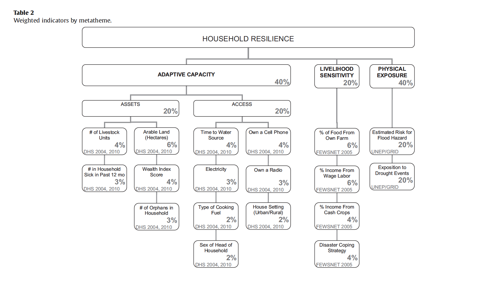
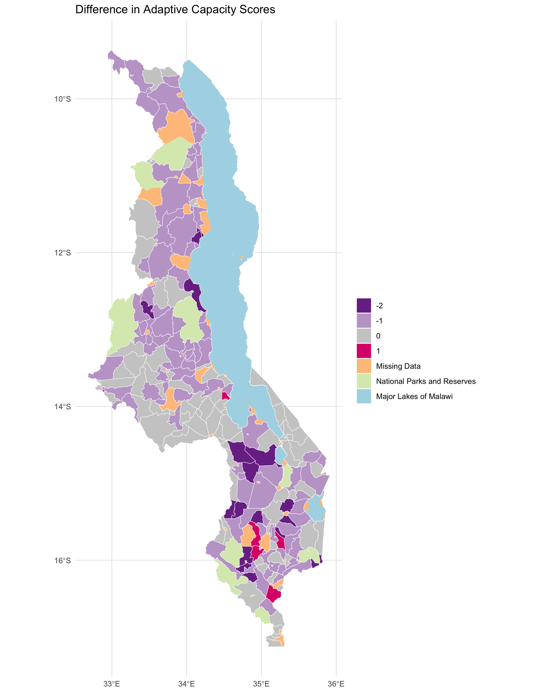
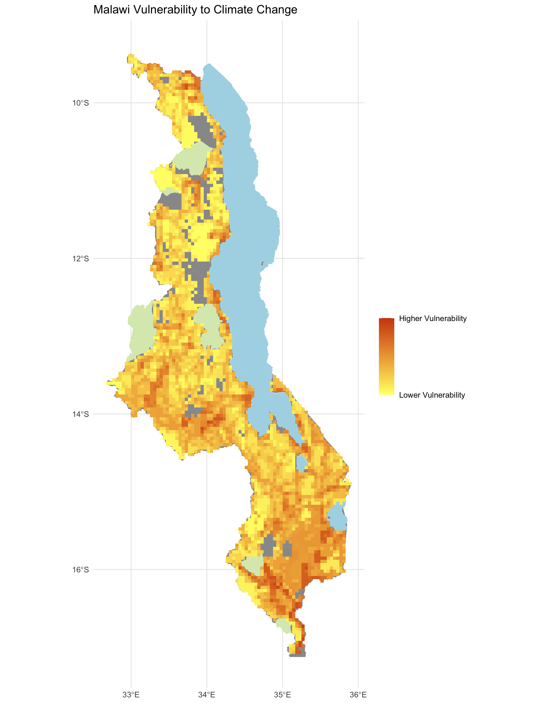
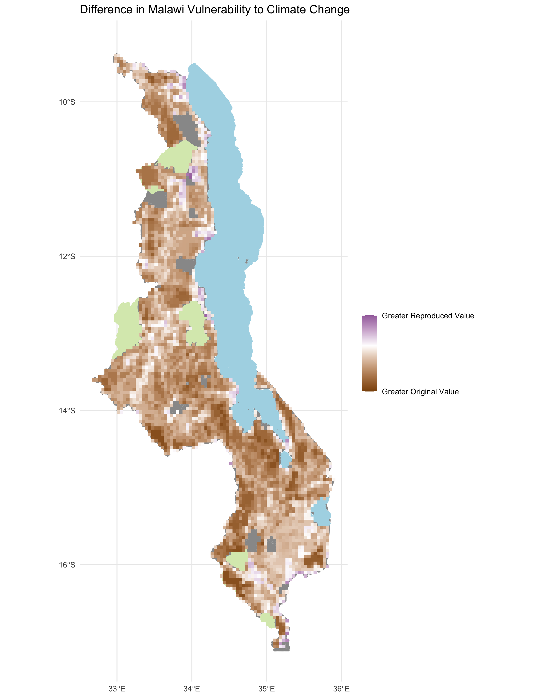

**Replication of Vulnerability Modeling for Sub-Saharan Africa**

Original study *by* Malcomb, D. W., E. A. Weaver, and A. R. Krakowka. 2014. Vulnerability modeling for sub-Saharan Africa: An operationalized approach in Malawi. *Applied Geography* 48:17–30. DOI:[10.1016/j.apgeog.2014.01.004](https://doi.org/10.1016/j.apgeog.2014.01.004)

Replication Authors:
Sanjana Roy, Maddie Tango, Arielle Landau, Evan Killion, Jackson Mumper, Steven Montilla, Joseph Holler, Kufre Udoh, Open Source GIScience students of fall 2019 and Spring 2021

Replication Materials Available at: [Forked RP-Malcomb Repository](https://github.com/sanjana-roy/RP-Malcomb)

Created: `29 April 2021`
Revised: `24 May 2021`

## Abstract

The original study is a multi-criteria analysis of vulnerability to Climate Change in Malawi, and is one of the earliest sub-national geographic models of climate change vulnerability for an African country. The study aims to be replicable, and had 40 citations in Google Scholar as of April 8, 2021.

## Original Study Information

The study region is the country of Malawi. The spatial support of input data includes DHS survey points, Traditional Authority boundaries, and raster grids of flood risk (0.833 degree resolution) and drought exposure (0.416 degree resolution).

The original study was published without data or code, but has detailed narrative description of the methodology. The methods used are feasible for undergraduate students to implement following completion of one introductory GIS course. The study states that its data is available for replication in 23 African countries. According to Tate (2013), Malcomb et al. (2014) is a classic example of the development of a social vulnerability index, which involves the "selection of demographic indicators, normalization of indicators to a common scale, and summation to a final value."


### Data Description and Variables

The study by Malcomb et al. (2014) attempts to create a multi-criteria analysis model of vulnerability in Malawi. The authors use three sources of data that investigate four different criteria or "metathemes": adaptive capacity, including access and assets, livelihood sensitivity, and physical exposure. These metathemes were decided upon after a series of interviews that the authors conducted to understand "household social and economic practices in the context of environmental uncertainty." These interviews also informed the weighting of the eighteen evidence-based indicators in order to statistically represent vulnerability, which is a common approach used in many vulnerability studies (Malcomb et al., 2014). This weighting is demonstrated in the table below:


**Figure 1.** Malcomb et al. (2014) Table 2 showing weighted indicators by metatheme

**ADAPTIVE CAPACITY**
Data from the Demographic and Health Survey (DHS) Program from 2004-2010, conducted by the U.S. agency for International Development (USAID) was used to to model household dynamics and socio-economic data, including the 'access' and 'assets' criteria. The DHS Program collects nationally-representative household-level data on a "wide range of monitoring and impact indicators in the areas of population, health, and nutrition" from over 90 developing countries ([DHS GPS Manual](https://dhsprogram.com/methodology/gps-data-collection.cfm)). These indicators are created based on their relevance within that country as well as their capacity for cross-country comparison. Standard DHS surveys are conducted every 5 years to allow for comparisons over time, with interim surveys conducted in between at smaller scales.

DHS data is collected by 'clusters', which can be described as census enumeration areas, consisting of multiple households that can form anything ranging from villages in rural areas to urban blocks (DHS GPS Manual). GPS locations are collected at the center of each cluster, and therefore, each household in a cluster is assigned the same coordinates. The DHS survey process takes place at a large scale of 250 - 500 clusters and involves conducting interviews through questionnaires and manually collecting GPS data at the cluster level through users trained in GPS data collection. This process allows for inevitable inconsistency and often, incompleteness, in the data. This uncertainty in the data is accounted for by the use of specific coded phrases indicating missing data, unknown responses, etc. ([DHS Data Quality and Use Site](https://www.dhsprogram.com/data/Data-Quality-and-Use.cfm)).

Malcomb et al.(2014) aggregated DHS survey cluster points into 250 traditional authorities spread across Malawi, allowing for analysis at an appropriate scale. The authors selected indicators from the data that allowed them to form their 'metathemes' of access and assets, including indicators such as land, livestock, health care, labour, water, etc.:

**Assets** are important coping strategies to understand vulnerability, adaptive capacity, and resilience. The following indicators were determined to increase or decrease household resilience in the context of climate-induced disasters or shocks:

THEORY | INDICATOR | VALUE   
-------|-----------|-------
Livestock | Number of animals per HH | None/More than 95/Unknown
Good Health | Number of HH members sick in the past 12 months for 3+ months| No/Yes/Don't Know
Arable Land | Amount of arable land per HH | 95/95 or more/unknown
Money | Wealth index (based on owned assets) | Poorest/Poorer/Middle/Richer/Richest
Orphan Care | Number of Orphans or vulnerable children in HH | Number of orphans or vulnerable children

**Access** indicators covered a wide range of areas, including resources, healthcare, education, markets, insurance, infrastructure, water, and sanitation:

THEORY | INDICATOR | VALUE   
-------|-----------|-------
Basics | Time to water source | On premises/Don't know
Basics | Electricity | Has electricity Yes/No
Basics | Type of Cooking Fuel | Electricity, LPG/Natural gas, Natural gas, Biogas, Kerosene, Coal/lignite, charcoal, wood, straw/shrubs/grass, agricultural crop, animal dung, no food cooked, other
Power and Decision Making | Female Headed HH | Yes/No
Media and Information | Own a Cell Phone | Yes/No
Technology Sharing | Own a Radio | Yes/No
Market Access | House Setting | Urban/Rural/Peri-Urban

**LIVELIHOOD SENSITIVITY**

This metatheme used [Famine Early Warnings Systems Network (FEWSNET)](https://fews.net/fews-data/335) data to assess livelihood sensitivity for nineteen livelihood zones. This data was developed by FEWSNET, who conducted interviews in Malawi in collaboration with the Malawi Vulnerability Assessment Committee (MVAC) and the USAID between May and July of 2003 to establish these zones. Livelihood zones (LZ) are areas where households share similar options for obtaining food and income. Maps of these LZs are produced through multi-day workshops where stakeholders and experts identify these different zones based on a number of factors, including elevation, land cover, market accessibility, etc. In 2003, nineteen different livelihood zones were established and aggregated. Wealth groups within each Livelihood zone were divided into categories of 'Poor', 'Middle', and 'Better-Off'. Using this data, four variables from livelihood zones were developed to evaluate the sensitivity of Malawi's livelihoods. Data from the different Livelihood zones were extracted based on these indicators. These were then converted into percentages based on the respective formulas. It is unclear as to how Malcomb et al. (2014) incorporated livelihood zones into their methods and results. This replication study joined livelihood ids to the existing DHS clusters that they encompassed.

THEORY | INDICATOR | VALUE   
-------|-----------|-------
Ability to meet Food Needs | % food intake from personal farm | % Crops as source of food
Income Source | % Income poor HH obtain from wage labour | (Labor/total) * 100
Cash Crop Exposure | % Income from cash crops | % Labor income that is susceptible to market shocks = (crops/total) * 100
Ecological Coping Effect | Access to alternative forms of income | % Income from practices that would lead to ecological destruction

The last variable described 'ecological destruction' as that associated with livelihood coping strategies during times of crisis in each zone: function of baseline access, possible hazards, and response strategies. Response strategies were broken down into expanding existing strategies and distress strategies. Hazards were broken down into periodic and chronic. Determining these practices was vague and there was much uncertainty in which practices were considered in the Malcomb et al.(2014) study.

**For the above three metathemes (Assets, Access, and Livelihood Sensitivity)**, indicators were converted to a 1-5 scale to match the Malcomb et al. (2014) study. There scores were then used to calculate capacity scores based on Table 2 in the paper by weighting them with percentages outlined in the model. These percentages were then converted to a 0-20 scale, by multiplying by 20, to resemble the range of the original study. Livelihood sensitivity and adaptive capacity were then rasterized to calculate vulnerability along with physical exposure.

**PHYSICAL EXPOSURE** data was acquired through the United Nations Environmental Program (UNEP) Global Disaster Risk Platform, which provides easily interpretable raster data on the risk of flood and drought exposure, two variables used under this metatheme. UNEP's Global Resource Information Database (GRID)- Europe designed this information for the global interpretation of these two variables in terms of risk evaluation, vulnerability, and information and early-warning. While more specific data to Malawi's context may have been more beneficial, this data offered the greatest coverage of the analyses area. The drought layer includes an estimate of global annual drought repartition based on global monthly precipitation data (Climatic Research Unit, University of East Anglia) and a Standardized Precipitation Index (Brad Lyon, IRI, Columbia University) from 1980 to 2001.

THEORY | INDICATOR | VALUE   
-------|-----------|-------
Floods and Rain Variability | Estimated Risk for Flood Hazard | Modeled using global data using an estimated index ranging 1 (low) to 5 (extreme)
Drought and Dry Spells | Estimated Risk to Drought Events | Expected average annual (2010) population exposed

Bilinear sampling was used for the drought layer to average continuous population exposure values and this layer was also reclassified into the quintile classification (1-5). Near sampling was used for the flood layer to preserve integer values.  

### Analytical Specification

The original study was conducted using ArcGIS and STATA, but does not state which versions of these software were used. The replication study will use R (`R 1.4.1103`) along with packages `classint`, `stars`, `sf`, `here`, `dplyr`, `rdhs`, `readr`, `ggplot2`, `s2`, `haven`, and `downloader`.

## Materials and Procedure

### Original Workflow

This workflow was created in response to our first reading of the Malcomb et al. (2014) study:

```
## Step 1: Processing of Data
  2004-2010 DHA data points (for each cluster): District --> DISAGGREGATED --> villages --> DISAGGREGATED --> traditional authorities

## Step 2:
  UNEP/GRID Europe + FEWSNET --> RASTER --> WEIGHTED (by values in Table 1 and normalized between 0 and 5)

## Step 3: Creating the Model of Vulnerability
  CALCULATE --> Household resilience = adaptive capacity + livelihood sensitivity - biophysical exposure

```

### Revised Workflow

This revised workflow was created after going through the code prepared by Joseph Holler and Kufre Udoh, based on the Malcomb et al. (2014) reproduction. This can be found [here]():

```
1. Data Preprocessing:
    - Download traditional authorities: MWI_adm2.shp
2. Adding Traditional Authorities (TA) and Livelihood Zone (LZ) ids to DHS clusters
3. Removing Household (HH) entries with invalid or unknown values
4. Aggregating HH data to DHA clusters, and then joining to traditional authorities to get: ta_capacity_2010
5. Removing index and livestock values that were NA
6. Sum of Livestock by HH
7. Scale adaptive capacity fields (from DHS data) on scale of 1 - 5 to match Malcomb et al.
8. Weight capacity based on table 2 in Malcomb et al.
    - Calculate capacity by summing all weighted capacity fields
9. Summarize capacity from households to traditional authorities
10. Joining mean capacities to TA polygon layer
11. Making capacity score resemble Malcomb et al s work (scores on range of 0-20) by multiplying capacity score by 20
12. Categorizing capacities using natural jenks methods
13. Creating blank raster and setting extent of Malawi - CRS: 4326
14. Reproject, clip and resampling flood risk and drought exposure rasters to new extent and cell size
    - Uses bilinear resampling for drought to average continuous population exposure values
    - Uses nearest neighbor resampling for flood risk to preserve integer values
    - Removing factors from flood layer and recasting them as integers
    - Clipping TAs with LZs to remove lake
15. Rasterizing final TA capacity layer
16. Masking flood and drought layers
17. Reclassify drought raster into quantiles
18. Add all RASTERs together to calculate final output:  final = (40 - geo) * 0.40 + drought * 0.20 + flood * 0.20 + LHZ * 0.20
19. Using zonal statistics to aggregate raster to TA geometry for final calculation of vulnerability in each traditional authority
```

### Final Workflow: Additions to Revised Workflow

Our final workflow involved the addition of calculated indicators from the FEWSNET livelihood zones data as well as procedures to compare to the Malcomb et al. (2014) results:

```
Livelihood sensitivity calculated after Step 12 (categorizing capacities using natural jenks method):
  - Pre- process livelihood data from FEWSNET livlihood zone spreadsheets with detailed information on surveys and results
  - Disaster coping strategy: % income from selling firewood, wild foods or grasses (income from   firewood + income from grasses + income from wild foods / total income * 100)
  - %Income from Cash Crops: (cash from crops / total income * 100)
  - %Food from own farm: (% of crops reported as sources of food)
  - %Income from wage labor: (labour etc. as source of cash / total income * 100)
  - Scale livelihood sensitivity fields on scale of 1 - 5 to match Malcomb et al.
  - Weight capacity based on table 2 in Malcomb et al.
  - Calculate livelihood sensitivity by summing all weighted fields

After Step 19 (using zonal statistics), results from our reproduction study were compared with Malcomb et al. results:
  - Figures 4 and 5 from the Malcomb et al. study were georeferenced, using the QGIS (3.16) georeferencer tool, by comparing them to traditional authority boundaries and extracting color values from the original maps using zonal statistics
  - The Adaptive Capacity map (Figure 4), visualized in a discrete choropleth, used mean values of red to recreate the four resilience classes  
  - For the Vulnerability map (Figure 5), visualized in a continuous raster, a vectorised raster grid was used, of the same extent and resolution as the vulnerability output, to extract the mean value of blue, used to indicate the relative vulnerability score
  - Maps were compared by first scaling the outputs on a scale of 0 to 1 in R and creating difference maps
  - The Spearman's Rho correlation test was used to test the agreement between our reproduction results and the Malcomb et al. (2014) study
  - Crosstablution of resilience values between the original and reproduced outcomes was visualized in a table
  - A scatterplot graphing the orignal and reproduced results of raster values was also used for comparison
```

## Replication Results

### Mapping Adaptive Capacity


**Figure 2.** Digitized map of Figure 4 in Malcomb et al. (2014). Digitization was conducted using the Georeferencer in QGIS


**Figure 3.** Difference in results of adaptive capacity from the Malcomb et al. (2014) original study and this replication study


**Table 1.** Matrix of comparison between Malcomb et al. (2014) original study and this replication study based on the Jenk's classification used in the original study

With a Spearman's Rho coefficient of 0.764, the Malcomb et. al (2014) adaptive capacity scores in Malawi were mostly supported by and aligned with the replication. This coefficient, which indicates how well two sets of ranked data correlate with each other, is 0 at no correlation, 1 at a positive correlation, and -1 at an inverse correlation. Therefore, our replication study demonstrates a relatively strong positive correlation with the original study. However, according to the difference map (Figure 3), the replication does appear to have a greater number of higher scores than the original. There seems to be only a few cases in which the original study adaptive capacity scores were greater. Having used the same data, it is possible that certain indicators were calculated differently than what was done in the original study. There may also be issues with the rescaling of variables through our multiplication by 20 in order to match the Malcomb et al. (2014) range, which may have pushed certain indicators higher than the original study.


### Mapping Vulnerability


**Figure 4.** Digitized map of Figure 5 in Malcomb et al. (2014). Digitization was conducted using the Georeferencer in QGIS


**Figure 5.** Difference in results of vulnerability from the Malcomb et al. (2014) original study and this replication study


**Figure 6.** Scatterplot demonstrating correlation between raster values of the original and replicated study

A Spearman's Rho result of 0.273 as well as the scatterplot in Figure 6 both demonstrate a weak correlation between the vulnerability mapping of the original and replicated studies. There was much uncertainty in calculating livelihood sensitivity indicators, which could be a major source of error in this replication.


## Unplanned Deviations from the Protocol

Replication and reproduction of scientific methods required a sound description of methodology. These are some of the changes we made from our original interpretation of the workflow in the Malcomb et al. (2014) study to our final workflow based on the data we accessed and the R code script created by Kufre Udoh and Joseph Holler:

1. The Malcomb et al. study classified indicators on a 0 to 5 scale, with 0 representing the worst condition for a household and 5 representing the best. Their use of the term "quintile" was confusing in this case as 0 to 5 would represent six different categories and not five. We made the decision to normalize our indicators on a scale of 1 to 5 instead, by multiplying indicator percent ranks by 4 and adding 1.
2. The numbers that we ended up with through our calculation of the capacity scores based on the percentage allocation were not in the same range as those in Malcomb et al.'s (2014) study. We had to adjust our workflow and multiply the adaptive capacity scores by 20 to resemble the original study scale.
3. Malcomb et al. (2014) did not detail any of the protocols or methods they used to clean and preprocess the original data. Our workflow included steps to remove NA values from the data as well as code that included joining certain variables in the data for a more logical workflow.
4. We found that the Malcomb et al. (2014) study did not elaborate on the methodology they used to calculate livelihood zone indicators, particularly for the "Disaster Coping Strategy" indicator, which is determined through "ecological destruction associated with livelihood coping strategies during time of crisis in each zone" and "access to alternative forms of income." We altered our workflow to calculate this by assessing the percent income from practices that would lead to ecological destruction. However, we had to make arbitrary decisions on what these practices could be and included practices such as selling firewood or grasses.


## Discussion

The replication of the Malcomb et al. (2014) study proved to be more of a success when replicating results for adaptive capacity scores with a Spearman's correlation of 0.764, but less so for the mapping of vulnerability, with a Spearman's correlation of 0.273. While the former denotes a strong positive correlation between the original and replicated study, it is still a low correlation given that we used the same data. Issues were seen to stem from lack of details in the original analysis as to how they conducted their methodology. The weak correlation in the latter replication speaks more to uncertainties that derived from the manner in which data was used and vulnerability indicators were calculated. In general, the Malcomb et al. (2014) study failed to provide necessary specifications in order to replicate or reproduce their vulnerability model. Models are meant to be tested, retested, and applied to different contexts. This replication of the Malcomb et al. (2014) study speaks to larger issues in the design and communication of social vulnerability models.  

While conducting our replication study, we found that uncertainty arose in many ways. Primarily, this uncertainty was found in the explanation and lack of detailedness of the methodology. The narrative format of the methodology section led to arbitrary interpretations in how certain processes took place in the original study. Details on preprocessing and how certain variables or indicators were calculated were oftentimes unclear or left out from the narrative. Their explanation of ranking vulnerability indicators on a quintile scale from 0-5 was confusing (as this would imply six different categories rather than five). We decided to rank these indicators on a scale of 1-5 instead, which may have led to differences in the our replicated output. Furthermore, it was also unclear as to where in the methodology aggregation took place from the household level to traditional authorities: before or after the weighting of variables. The lack of a clear and precise workflow led to many uncertainties in comprehending the methodology narrative.

We also noticed that uncertainty arose in the translation of real world phenomenon and processes into data to use for modeling. It was unclear as to how certain vulnerability indicators, such as 'sex of head of household',  were ranked on a quintile scale. From the DHS data itself, classifications for indicators, such as 'hectares of agricultural land' - 95 hectares, more than 95 hectares, or unknown -  were left unexplained and seemed arbitrary. However, the largest uncertainty in our replication study was the calculation of livelihood sensitivity indicators, which would have likely led to the large discrepancies between vulnerability mapping of our study and the original. This dilemma is termed by Tate (2013) as "epistemic uncertainty," which stems from an "incomplete or imprecise understanding of parameters that are modeled with fixed but poorly known values" or a "misrepresentation of processes." Although the methods in calculating indicators was somewhat defined by Malcomb et al. (2014), calculating certain indicators required the use of subjective decision-making from our understanding of the study and data they used. Therefore, uncertainty arises form both the error in measurement of input data as well as the transformation of data into variables.

According to Tate (2013) this study would be a classic example of the development of a vulnerability index, which involves the "selection of demographic indicators, normalization of indicators to a common scale, and summation to a final value." As the author points out, there is little consensus on how indexes are developed and how different variables are interpreted, which is the the case of this replication study. These uncertainties in the inputs of the model have significant consequences for the derived output. Longely et al. (2008) defines a method for understanding how these uncertainties can manifest and develop in spatial research from the real world referents to problem conceptualization, measurement and representation, analysis, to interpretation and validation. Each one of these steps introduces a new form of uncertainty that each amounts to a result further from the real world phenomenon. With "improved knowledge, data, and modeling processes, epistemic uncertainty can be reduced" and uncertainty analyses can help improve upon the robustness of the model structure as well as its potential to be replicated and reproduced (Tate, 2013).

## Conclusion

This replication of the Malcomb et al.(2014) study proves that there is much to consider when developing a social vulnerability model. Models are meant to be applied to different contexts and therefore, their capacity for reproducibility and replicability must be tested for. The provision of a more detailed methodology from the measurement of variables and real-world translation to aggregation is of utmost importance in these kinds of studies. Transparency in methodology can be improved through providing the code and processing details behind the model. However, epistemic uncertainty is ultimately inevitably associated with social vulnerability models. Its prevalence can be reduced through the use of uncertainty analyses, as suggested by Tate (2013), as a method to improve the quality and applicability of such a model.


## Acknowledgement

Major thanks to the group members I worked with - Maddie Tango, Jackson Mumper, Evan Killion, Arielle Landau, and Steven Montilla Morantes - in replicating this study. Thank you to Joe Holler and Kufre Udoh for providing the code for this replication as well as guidance on the technical matters.


## References

Longley, P. A., M. F. Goodchild, D. J. Maguire, and D. W. Rhind. 2008. Geographical information systems and science 2nd ed. Chichester: Wiley. Chapter 6: Uncertainty, pages 127-153.

Malcomb, D. W., E. A. Weaver, and A. R. Krakowka. 2014. Vulnerability modeling for sub-Saharan Africa: An operationalized approach in Malawi. Applied Geography 48:17–30. DOI:10.1016/j.apgeog.2014.01.004

Tate, E. 2013. Uncertainty Analysis for a Social Vulnerability Index. Annals of the Association of American Geographers 103 (3):526–543. doi:10.1080/00045608.2012.700616.


####  Report Template References & License

This template was developed by Peter Kedron and Joseph Holler with funding support from HEGS-2049837. This template is an adaptation of the ReScience Article Template Developed by N.P Rougier, released under a GPL version 3 license and available here: https://github.com/ReScience/template. Copyright © Nicolas Rougier and coauthors. It also draws inspiration from the pre-registration protocol of the Open Science Framework and the replication studies of Camerer et al. (2016, 2018). See https://osf.io/pfdyw/ and https://osf.io/bzm54/

Camerer, C. F., A. Dreber, E. Forsell, T.-H. Ho, J. Huber, M. Johannesson, M. Kirchler, J. Almenberg, A. Altmejd, T. Chan, E. Heikensten, F. Holzmeister, T. Imai, S. Isaksson, G. Nave, T. Pfeiffer, M. Razen, and H. Wu. 2016. Evaluating replicability of laboratory experiments in economics. Science 351 (6280):1433–1436. https://www.sciencemag.org/lookup/doi/10.1126/science.aaf0918.

Camerer, C. F., A. Dreber, F. Holzmeister, T.-H. Ho, J. Huber, M. Johannesson, M. Kirchler, G. Nave, B. A. Nosek, T. Pfeiffer, A. Altmejd, N. Buttrick, T. Chan, Y. Chen, E. Forsell, A. Gampa, E. Heikensten, L. Hummer, T. Imai, S. Isaksson, D. Manfredi, J. Rose, E.-J. Wagenmakers, and H. Wu. 2018. Evaluating the replicability of social science experiments in Nature and Science between 2010 and 2015. Nature Human Behaviour 2 (9):637–644. http://www.nature.com/articles/s41562-018-0399-z.
