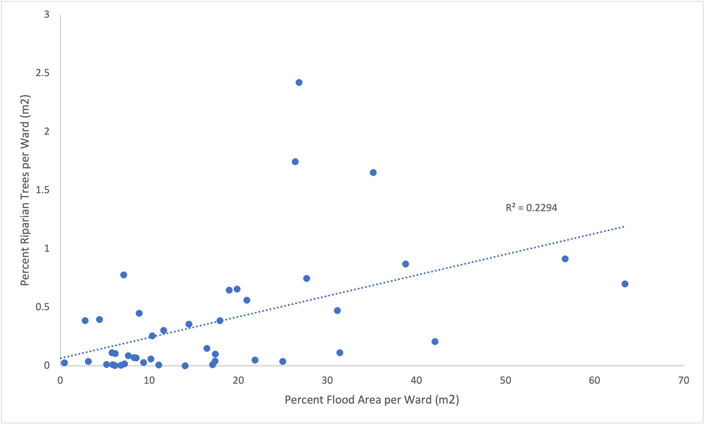

This was a collaborative project between [Sanjana Roy](https://sanjana-roy.github.io) and [Jackson Mumper](https://jackson-mumper.github.io).

April 5, 2021

**Introduction**

This lab focuses on the relationship between riparian trees and flood zones in Dar es Salaam. Along with the countless other benefits of urban vegetation, vegetation around river systems has been observed to significantly reduce flood levels [(Stanton, 2020)](https://krex.k-state.edu/dspace/handle/2097/40582). Using Dar es Salaam as a landscape, we wanted to see whether urban wards with higher densities of riparian trees also saw low incidence of flooding. If true, this would lend credence to models of urban resilience through nature-based solutions and provide useful information for planners and developers in the region.

**Data Sources**

Our data sources have been acquired from (OpenStreetMap)[https://www.openstreetmap.org/#map=12/-6.8162/39.2804], a community-based mapping project and platform providing open data and emphasizing contributions of local knowledge. One such contribution that has been significant for developing data on Dar es Salaam is the (Ramani Huria)[https://ramanihuria.org/en/] project, which trains university students and local community members to create highly accurate maps of their localities. This initiative initially began as a project to accurately map out flood-prone areas in the city, however, it has now expanded to serve as a foundational tool for addressing different social and environmental spheres beyond resilience. We have used this OpenStreetMap data to collect information on flood-prone areas, trees, forests, and rivers for the purposes of our analysis.

**Methods**

The above data was gathered through PostGIS in QGIS and database queries using SQL were run for our analysis. Data tables were extracted from OpenStreetMap (OSM). We found tree data to be present on OSM in two different vector types: a tree point layer and a forest area polygon layer. Buffers of 20 feet (6 meters) were created around each tree point as absorption of water into the soil takes place within a certain radius of a tree center due to its vast root network. These buffer polygons were then grouped with the forest polygon layer to form a singular polygon layer for all trees in Dar es Salaam. Riparian buffers of 50 feet (15 meters) were added to rivers and streams flowing through the city. The trees polygon layer was then clipped using the riparian buffers to extract the trees, or vegetation, that fell within this determined riparian zone. This riparian vegetation layer was then dissolved and clipped by wards. The area of the riparian vegetation as well as the flood area was calculated for each ward and the percent of each wards landmass covered by these two layers was compared in the form of a scatterplot shown below.

The full script used in this analysis can be downloaded [here](LINK TO SQL SCRIPT).

**Results**

A full, interactive map of riparian trees, riparian buffers, flood zones, and ward boundaries in our study region can be found [here](assets/index.html).

The scatterplot in Figure 3 illustrates the correlation between riparian trees and incidence of flooding by ward in Dar es Salaam.

As shown in the scatter plot, there is actually a positive correlation between riparian trees and flooded areas. This means that wards with higher densities of tree cover near rivers had experienced more flooding than those farther away. This goes against our original hypothesis that riparian trees would reduce flood areas on Dar es Salaam. However, the correlation is weak, and the R^2 value is low enough to warrant further investigation.

While these data go against traditional understandings of the effects of riparian vegetation on flooding, there are a few aspects of our methodology that might have contributed to this outcome. To start, certain parts of the city that saw greater flooding were closer to the mouth of the river. This tends to be the widest and shallowest section of a river, therefore making it most likely to flood. In addition, forest patches along the river were mostly found downstream, near the coast. Because of this, downstream wards tended to have both the highest incidence of flooding and the largest observed riparian trees, leading to a positive correlation that might not be the result of a causal relationship.

Furthermore, our methods of aggregating data posed as an issue given the nature of the ward boundaries in Dar es Salaam. Ward boundaries follow river systems, causing both flood areas and riparian buffers to be split by multiple wards through our analysis. Therefore, aggregation of data by wards is perhaps not the most logical way to conduct this analysis. A raster-based approach, which would take into account existing trees through satellite data, without relying on the tree “point” contributions of the local community would have led to more accurate results.

Our analysis only used OSM layers of tree point data and forest polygon data to account for riparian vegetation. However, the presence of other types of land cover, such as parks, cemeteries, or wetlands, may also either contain trees or contribute to lower rates of flooding in a given area. This analysis could be further improved through assessing the ability of different types of land cover to contribute to flood resilience and adding these layers to our model.

Due to the open source nature of OSM, there are also limitations to the accuracy and precision of the river data. The rivers and streams in OSM did not always correspond with flooding, and sometimes streams were disconnected from the rest of the river network. In addition, while ward boundaries often followed rivers, the specific boundaries were rarely a perfect representation of the river centerline. For most analyses this wouldn’t make a difference, but when looking using riparian buffers as refined as 50 meters, this can make a big difference in the end results.

This was also apparent in OSM’s tree data. Locations of individual trees were not collected from each ward. Much of the study area had a forest polygon layer, but not the tree points layer. We originally sought to exclude wards without trees from the analysis by ignoring wards with no riparian trees, but because these wards still did have forest data, they ended up with an undercounted presence of trees.

Although this methodology is flawed, further investigation with more robust techniques could help urban resilience planning in Dar es Salaam and future projects. A more robust analysis could include:
1. A greater array of potential confounding variables
2. More accurate data, potentially satellite imagery or raster data
3. Aggregation by river/stream rather than by wards
