**Replication of A classification of natural rivers**

Original study *by* Rosgen, D. L.
*in* *CATENA* 22 (3):169–199. https://linkinghub.elsevier.com/retrieve/pii/0341816294900019.
and
Replication by: Kasprak, A., N. Hough-Snee, T. Beechie, N. Bouwes, G. Brierley, R. Camp, K. Fryirs, H. Imaki, M. Jensen, G. O’Brien, D. Rosgen, and J. Wheaton. 2016. The Blurred Line between Form and Process: A Comparison of Stream Channel Classification Frameworks ed. J. A. Jones. *PLOS ONE* 11 (3):e0150293. https://dx.plos.org/10.1371/journal.pone.0150293.

Replication Authors: Sanjana Roy, Zach Hilgendorf, Joseph Holler, and Peter Kedron.

Replication Materials Available at: [Forked RE-Rosgen Repository)](https://github.com/sanjana-roy/RE-rosgen)

Created: `24 March 2021`
Revised: `24 May 2021`

## Introduction

This study attempts to use the Rosgen Stream Classification System (RCS), which is a method of classifying streams and rivers based on their form and morphology at a particular moment in time, through replicating findings from the Kasprak et al. (2016) study of the Middle Fork John Day Basin (MFJD), a watershed of high conservation interest within the Columbia River Basin. The Rosgen classification attempts to “provide a consistent and reproducible frame of reference of communication for those working with river systems in a variety of professional disciplines” (Rosgen, 1994). It uses four hierarchical stages of classification under four different ‘Levels', of which this study focuses on the first two. Level 1 utilizes morphological ratios of rivers, such as entrenchment, width/depth, and sinuosity, from variables observed and calculated through site measurements, like bankfull width, bankfull depth, valley width, valley length, channel length, etc. Level 2 utilizes characteristics, such as the slope of the valley and channel material, to further determine classification. There has been an increase in the use of GIS in aiding to classify streams according to their aforementioned characteristics; however, its application has not been standardized. As RCS is “arguably the most commonly used stream classification system in North America and the world,” its replication through GIS modelling would be particularly helpful through applications in river maintenance, flood control, channel and riparian protection and restoration, impact assessment, etc. (Kasprak et al., 2016).

Therefore, this study attempts to create and practice a method of replicability of the Rosgen Classification System using high resolution terrain models to classify sections of streams and rivers, or “reaches.” We attempt to replicate the RCS analysis of Kasprak et al.’s (2016) study, which compared four different classification methods at the MFJD watershed scale.

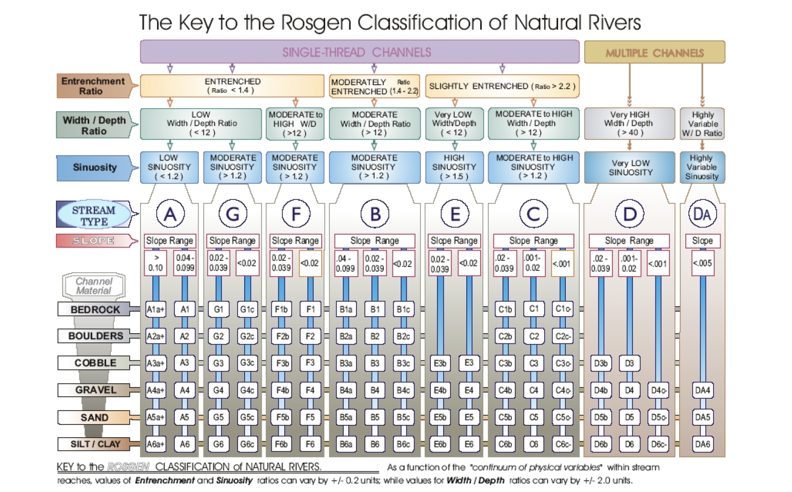
*Figure 1. Level I and II of the Rosgen Classification System*

## Data

The metatdata and data files can be found [here](https://github.com/sanjana-roy/RE-rosgen/tree/main/data/metadata).

### CHaMP Data
The Columbia Habitat Monitoring Program (CHaMP) has collected data from the 26 watersheds around the Columbia River basin in order to generate and implement a set of standard methods for monitoring fish habitat. This data, which is a subset of the original, includes points from the John Day River (MFJD) in the state of Oregon, USA. It contains information on reaches, of which details were collected during 2012 and 2013, at wadable, perennial streams selected through random sampling. Each reach includes information on channel bankfull width and depth, gradient, substrate, and sinuosity. Each sampled reach is twenty times as long as the bankfull channel width at each site (120-360 m in length).

### John Day Watershed Data
This is the John Day River watershed LiDAR DEM with a resolution of 1m, collected between Aug 19th and 27th, 2008. This is also a clipped version of the original dataset, focusing on the Middle Fork of the John Day River, encompassing the CHaMP points mentioned above.

## Methods

Procedures followed in this analysis can be found [here](https://github.com/sanjana-roy/RE-rosgen/tree/main/procedure). Analysis was done on a MacOS (v. 10.15.5) and required the installation of [The Unarchiver](https://theunarchiver.com/) and [XCode](https://idmsa.apple.com/IDMSWebAuth/signin?appIdKey=891bd3417a7776362562d2197f89480a8547b108fd934911bcbea0110d07f757&path=%2Fdownload%2Fmore%2F&rv=1).

### Kasprak et al. (2016) Analysis
Kasprak et al. (2016) classified 33 CHaMP reaches in the MFJD Basin using Levels I and II of the RCS.
The study used DEMs of grid resolutions 10m and 0.1m, aerial imagery, and ground-based assessments to understand stream morphological characteristics in order to fulfil the Level I classification. Processing was done using the [River Bathymetry Toolkit (RBT)](https://essa.com/explore-essa/tools/river-bathymetry-toolkit-rbt/) and the [CHaMP Topo Toolbar](http://champtools.northarrowresearch.com/), both used with ESRI ArcGIS software. In order to further classify streams at Level II, Kasprak et al. (2016) then used river bed material size identified by the CHaMP survey from the stream reaches.

### Class Analysis
As a class, we were randomly assigned 17 CHaMP points to classify through replication of the Kasprak et al.(2016) methods. I was assigned the Granite Boulder Creek stream (loc_id = 10) to analyse.

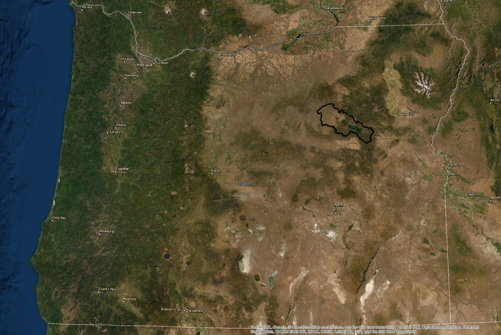
*Figure 2. State of Oregon, USA, with the Middle Fork John Day River outlined in black and CHaMP sites.*

We used GRASS GIS (7.8.5 for MacOS) for the processing of the two layers of data, the CHaMP points and the MFJD Watershed tif file. [A model](https://github.com/sanjana-roy/RE-rosgen/blob/main/procedure/code/visualize.gxm) was used to create buffer zones around the CHaMP survey points, as Rosgen (1994) suggests analyzing a distance of 20 channel widths, applied in the distance settings. The model also uses the LiDAR MFJD image to create a Digital Elevation Model (DEM) with colors, hillshade, and slope layers.

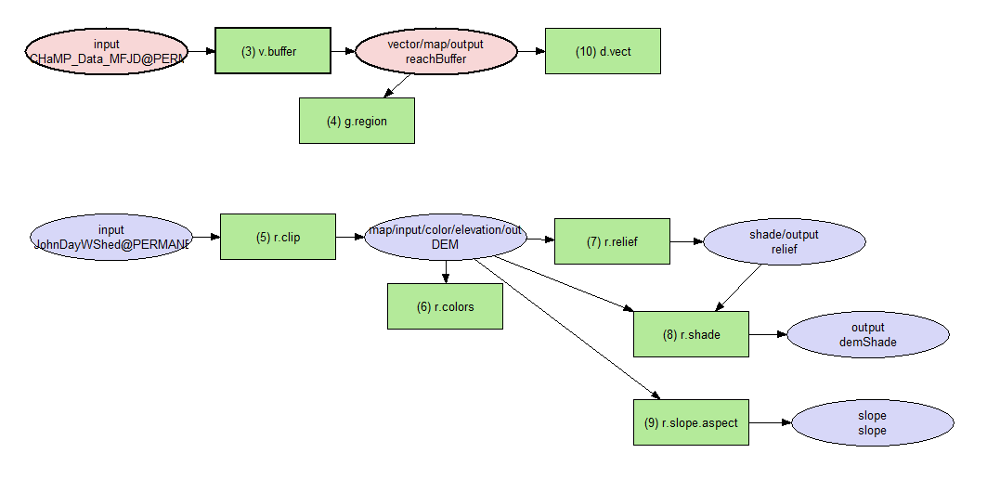
*Figure 3. Model 1 workflow*

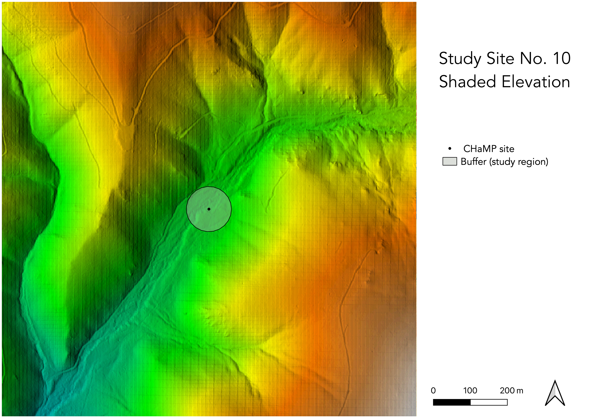
*Figure 4. Map of Study Site Elevation*

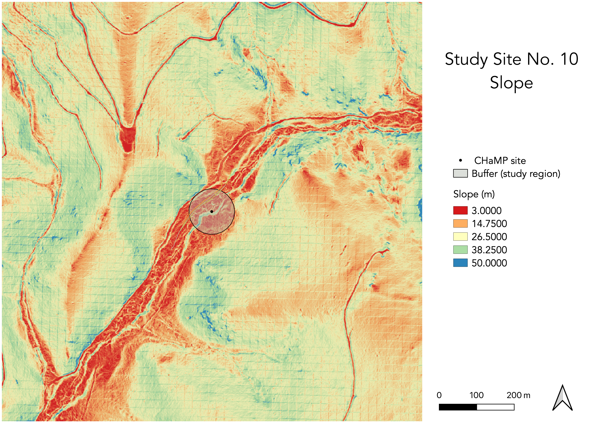
*Figure 5. Map of Study Site Slope*

The stream banks and valley edges were manually digitized with respect to the length of the buffer at a scale of 1:1500. This digitization was done three times for both the banks and valley edges. [A second model](https://github.com/sanjana-roy/RE-rosgen/blob/main/procedure/code/center_line_length_no_clip.gxm) was then used to find the averages of each set of lines as well as the “average of the average,” providing us with a final banks line and valley line. As the valley lines fell outside the radius of the buffer, we did not use a clip function to calculate the centerlines, as shown in the workflow, but used the raw digitazation done manually.

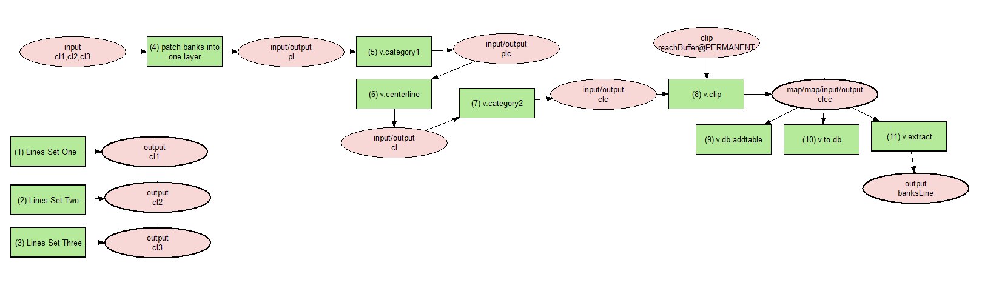
*Figure 6. Model 2 workflow.*

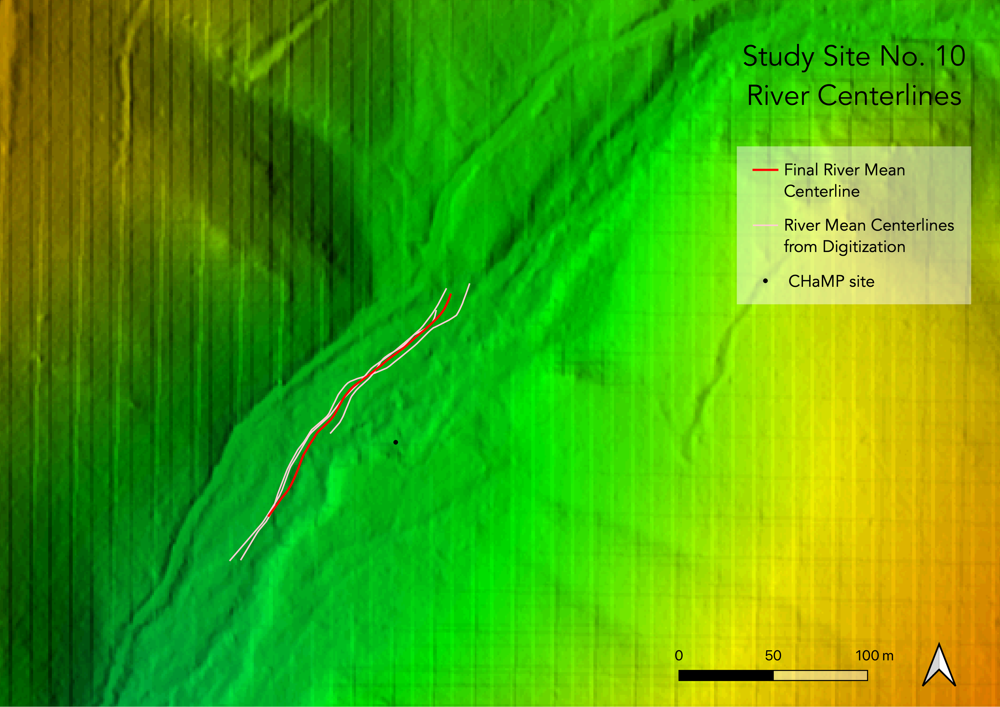
*Figure 7. Map of study site stream centerlines and final mean centerline*

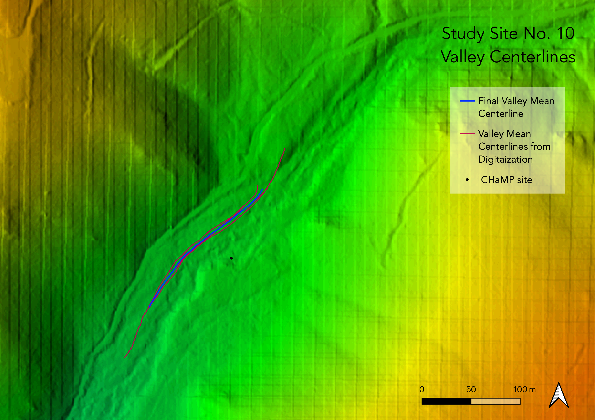
*Figure 8. Map of study site valley centerlines and final mean centerline*

The longitudinal and cross-sectional profiles of the reach were then extracted using the averaged streams and valley lines. Each profile consisted of a set of points spaced 1 m apart. This data was then exported and visualized in graphs in RStudio (v 1.4.1103 for MacOS) using [this code](https://github.com/sanjana-roy/RE-rosgen/blob/main/procedure/code/2-ProfileViewer.Rmd). Analysis using the R code allows us to determine the Slope of the stream as well as the Valley width (Table 1).

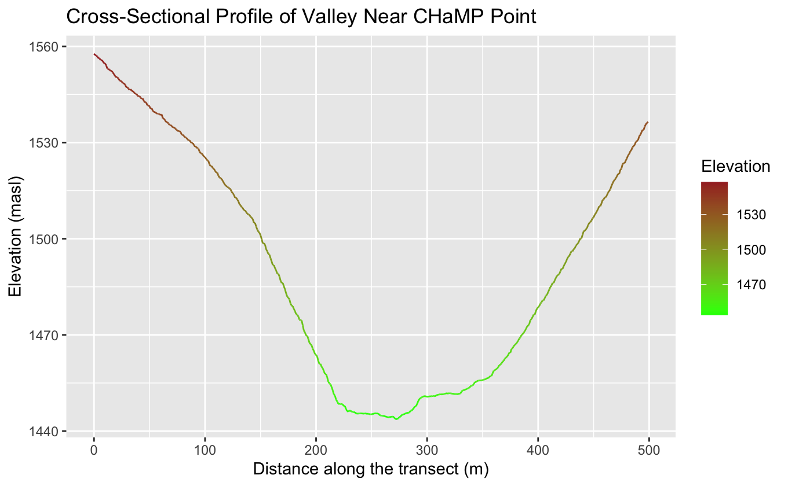
*Figure 9. Cross-Sectional Profile of Valley Near CHAMP Point*

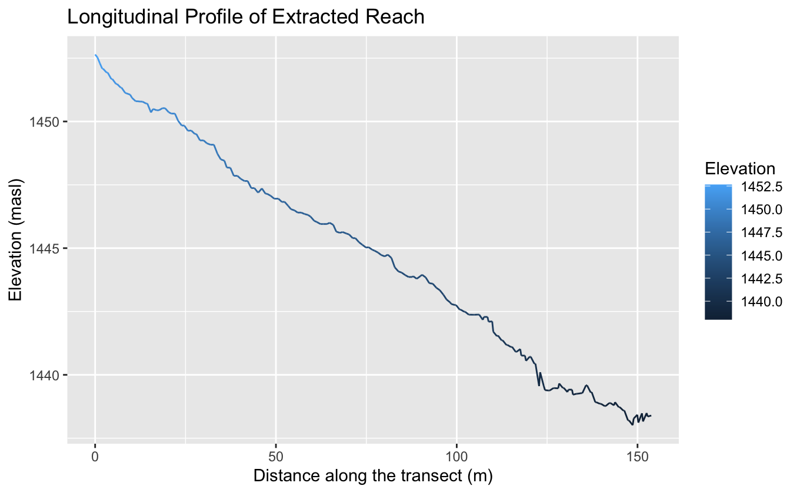
*Figure 10. Longitudinal Profile of Extracted Reach*

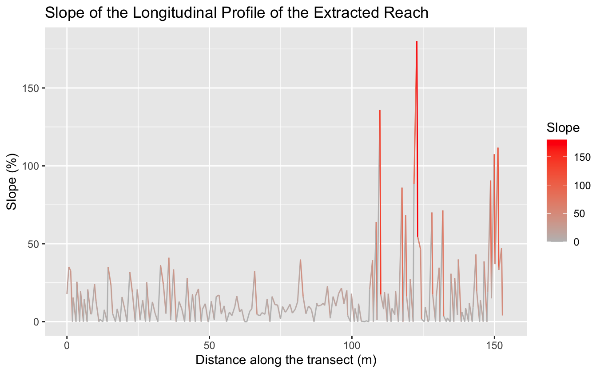
*Figure 11. Slope of the Longitudinal Profile of Extracted Reach*

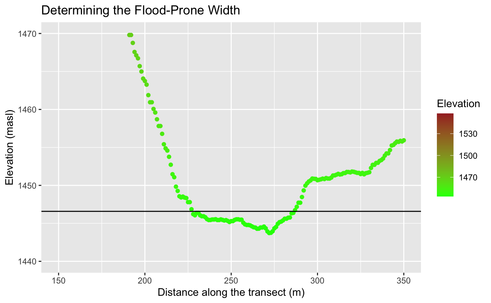
*Figure 12. Determining the Flood-Prone Width Using the Cross-Sectional Profile and the Maximum Bankfull depth x 2*Elevation*

### Differences between our methods and Kasprak et al. (2016)
1. The computational environments that were used in these two studies were different, possibly introducing many uncertainties in how the analysis was carried out. Kasprak et al. (2016) used RBT and the CHaMP Topo Toolbar with ESRI ArcGIS to process and analyze data, while this study used a combination of GRASS GIS and RStudio.
2. Although we are not aware of whether Kasprak et al. (2016) used LiDAR in their analysis, the DEM files were of a resolution of 0.1m, allowing a finer digitization of stream and valley edges. DEM resolution in this study was 1m.
3. Finally, Kasprak et al. (2016) were able to conduct field observations, which would have largely influenced the accuracy of their digitazation as well as general understanding of the landscape.

### Unplanned Deviations from the Protocol
1. The second model made use of a buffer around the CHaMP site, which clipped the digitized bank and valley lines to a similar length, aiding in standardizing the lengths and the calculation of the centerlines. However, the valley appeared to be beyond the radius of the buffer and therefore, another model was created (by Joe Holler) where clipping with a buffer was excluded from the workflow so as not to cut off digitized valley lines.
2. We found that the R code calculates slope by taking the average of every point along the longitudinal profile, which would lead to inaccurate results with errors in the digitization of data, often resulting in outliers in the elevation. Therefore, the slope was calculating by taking points from the longitudinal profile, that seemed to correspond to a certain gradient, and dividing the change in rise over the change in run. The R code slope was 15.78 while the calculated slope was 0.086.

## Results

**Table 1. Site Measurements**

| Variable | Value | Source |
| :-: | :-: | :-: |
| Bankfull Width | 6.1004 | CHaMP data: BfWdth_Avg |
| Bankfull Depth Maximum | 1.4275 | CHaMP data: DpthBf_Max |
| Bankfull Depth Mean | 0.3212 | CHaMP data: DpthBf_Avg |
| Valley Width | 60(m) | Terrain Cross-Section |
| Valley Depth | 2.855 | Bankfull Depth * 2|
| Stream/River Length | 154.46(m) | Mean Stream Centerline from GRASS|
| Valley Length | 167.83(m) | Mean Valley Centerline from GRASS|
| Median Channel Material Particle Diameter | 152 | CHaMP data: SubD50 |

**Table 2. Rosgen Level I Classification**

| Criteria | Value | Formula |
| :-: | :-: |
| Entrenchment Ratio | 9.835 | (Valley Width at Bankfull Depth * 2) / Bankfull Width |
| Width / Depth Ratio | 18.99 | Bankfull Width / Bankfull Depth Mean|
| Sinuosity | 0.920 | Stream Length / Valley Length |
| Level I Stream Type | Either E or C |

**Table 3. Rosgen Level II Classification**

| Criteria | Value |
| :-: | :-: |
| Slope | 0.086 |
| Channel Material | Gravel |
| Level II Stream Type | Unclear |

## Discussion

Kasprak et al. (2016) found the the CHaMP reach of the the Granite Boulder Creek to have a classification of B4, with moderate entrenchment and width/depth ratio. While my analysis was unable to be categorized by the Rosgen Key, it seems as though it would fall under a Level I Classification of C. Although the entrenchment and width/depth ratios fit this classification, the sinuosity variable (0.92) was too low for this stream type, which required a sinuosity of > 1.2. The slope range was between < 0.001 to 0.039, of which the slope I calculated (0.086) did not fall within.

As both methods used the same CHaMP data, the only differences that could have occurred in the final variables were the entrenchment ratio, sinuosity, and slope, as these were dependent on the digitization of stream and valley lines. The width/depth ratio and the channel material should result in the same classification outcomes, as these were derived directly from the CHaMP data. There was much uncertainty surrounding the manual digitization of stream and valley lines using the DEM layers. Although the valley definition was clearer at my site, identifying the edges of the stream was a challenge. From observing Granite Boulder Creek on [Google Satellite](https://earth.google.com/web/search/Granite+Boulder+Creek+/@44.66897433,-118.62896297,1285.85473832a,918.12265464d,35y,-0.00036505h,2.82287309t,0r/data=CigiJgokCTImDwoc30RAEet8gSPMIjZAGSY3UaL7xVXAIdYpf-1bFFzA), the stream is mostly hidden by the tree cover, making it difficult to understand whether the stream is a single channel or contains multiple different channels. I had identified the road that runs parallel to the stream; however, it seems as though there are multiple paths within the valley as well. From the high width/depth ratio of around 19, we understand the stream to be quite shallow. It also appears as though the stream dries up further downhill as there is a road without a bridge running through it. Therefore, the stream seems as though it might follow a thin and shallow pathway that may have also carved different pathways over the years, which may explain the different paths in the imagery. However, this is something we cannot discern from satellite imagery. Kasprak et al. (2016) had the advantage of visiting the site and possibly demarcating these areas more accurately. This uncertainty in our methods may have led to errors in our final results.

Furthermore, our methods used LiDAR data that comes with its own uncertainties and challenges. LiDAR data collection itself may result in errors and noise from sensing obstructions, such as bridges and trees, which cover most of the valley. The data often also has a layer of grid lines that can make surfaces difficult to interpret. Therefore, the data itself could be a possible source of error in this analysis.

## Conclusion

Although methods can be replicable, this study demonstrated that the translation of real-world physical characteristics into data carries with it many uncertainties that may be interpreted differently across groups conducting replicability studies. The main area of difference between the methods of this study and Kasprak et al. (2016) was the digitization of stream and valley banks. Replicating analyses would be more accurate through field-based work in order to better understand the physical context of a site. This is especially important for stream geomorphology and classification as rivers are dynamic in nature and change over time, and certain physical characteristics are difficult to discern from aerial imagery and analysis. Although the models we used were useful to standardize our methods across the class, and possibly for future replication by others, deviations in our methods demonstrated that models may not always account for certain situations, such as when valleys edges lie outside a buffer. There may always be uncertainties in replicability studies for stream classification, however, with increased testing of the accuracy of studies, we may be able to improve upon models and data interpretation to attain more accurate results.

## Acknowledgements

Thank you to Joe Holler and Zach Hilgendorf for designing this study and providing materials. Thank you to Maddie Tango and Steven Montilla, with whom I worked closely.
