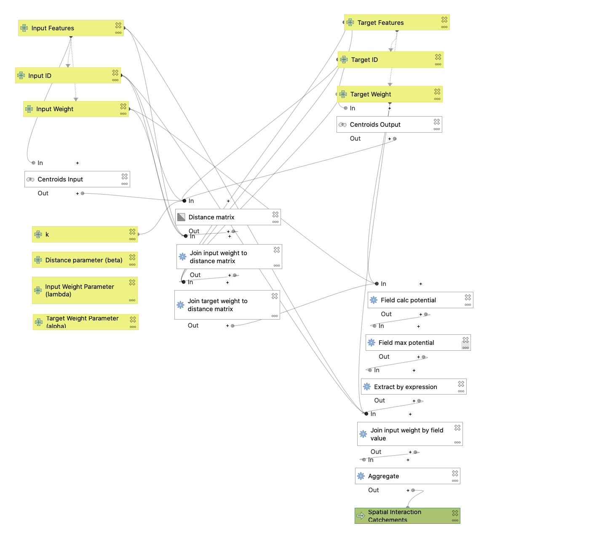
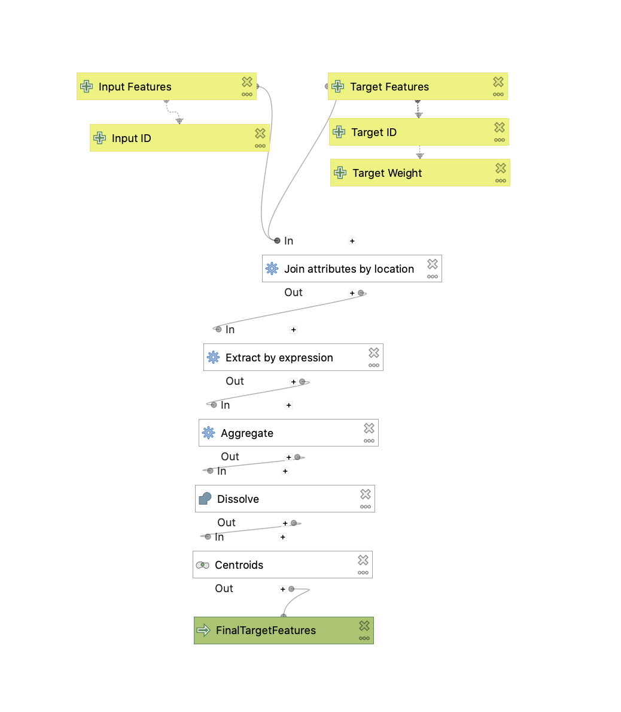
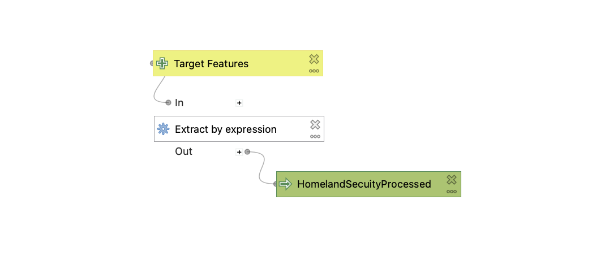
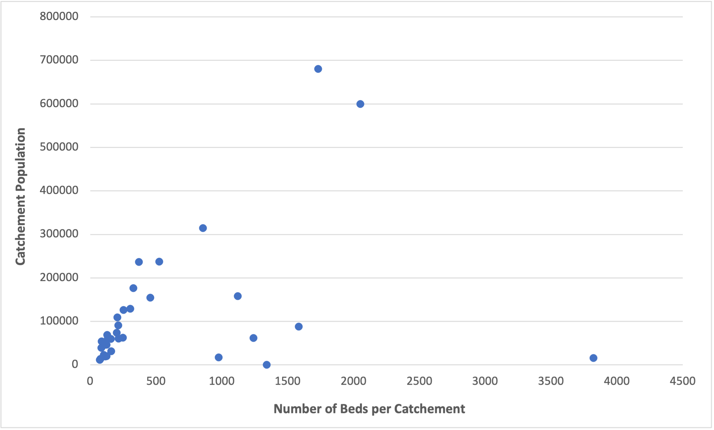

## Introduction

This study is concerned with the automation of the Gravity Model of Spatial Interaction using the QGIS graphic modeler. Models were developed for the Gravity Model as well as for the preprocessing of features that are inputed into the model. This model was applied to the state of Connecticut to understand interactions between town populations and hospitals in the state, generating hospital catchement areas based on the number of emergency rooms and I.C.U services present in each hospital. The results of this model were then compared with the [Dartmouth Atlas of Health Care Hospital Services Areas (HSAs)](https://atlasdata.dartmouth.edu/downloads/supplemental#boundaries), where catchement areas are instead organized by zip code tabulation areas based on databases of patients using medicare and medicaid.

## The Gravity Model ([Link to model](assets/GravityModel.model3))

The Gravity Model of Spatial Interaction is a tool used to predict the amount of interaction between two places. The model estimates catchment areas for any given service point using "weights" or "attractiveness" of input and target layers and a distance matrix. Centroids of the input polygon are created and put into a distance matrix along with target features. The distance matrix by default evaluates interaction with 20 of the nearest target features, however, this 'k value' can be adjusted under advanced settings. Input and target weights are joined and the potential for interaction is calculated. The parameters of friction of distance (alpha), input weight or emissivity (beta), and target weight or attractiveness (lambda) are advanced settings to allow full implementation and adjustment of the gravity model formula as found in Rodrigue's ["The Geography of Transport Systems"](https://transportgeography.org/contents/methods/spatial-interactions-gravity-model/):
>(inputWeight)^λ * (targetWeight)^α / (distance)^β

The maximum potential of each input feature in relation to a target feature is extracted for and input features are aggregated and dissolved according to the spatial reach of each target feature.

## Target Features Preprocessing Model ([Link to model](assets/TargetFeaturesPreprocessing2.model3))

This model is to be used in preparation for the Gravity Model of Spatial Interaction. In many cases, target features may need to be aggregated due to their proximity to one another. It often makes most sense to aggregate them by the same spatial units used for the input features in the Gravity Model. Target features are dissolved according to the input features they share in common and centroids are created for the respective groups.

## Homeland Security Processing Model ([Link to model](assets/HomelandSecurityPreprocessing.model3))

This model is used to specifically process Homeland Security Hospital data for use as an input polygon layer in the Gravity Model of Spatial Interaction. Data is cleaned according to the following criteria:
1. Hospitals that only have normal intensive care units for public use (removing psychiatric and military hospitals)
2. Hospitals with missing data on the number of beds are excluded
3. Hospitals that are closed are excluded

## Implementation

In this example, the gravity model is used to estimate catchment areas for hospital emergency rooms and I.C.U. services by towns in the state of Connecticut. A Connecticut polygon layer (with fixed geometries) was used to clip New England towns with stored population data and town names (Thanks Maddie for this idea). Homeland hospital data was passed through the Homeland Security Processing and the Target Features Preprocessing Model. Towns served as the input features with town names and populations as respective unique identification fields and weight fields while hospitals served as the target features with hospital name and number of beds as the same respective fields. Advanced parameters were left at default settings.

In order to compare the data generated through this model, [Dartmouth Atlas of Health Care Hospital Services Areas (HSAs)](https://atlasdata.dartmouth.edu/downloads/supplemental#boundaries) are provided, where catchments are organized by zip code tabulation areas based on databases of patients using medicare and medicaid.

## [Web Map of Results](assets/)

## Interpretation of Model Results with the Dartmouth Atlas HSAs

*Relationship between beds of hospital clusters and populations included in the hospital service areas created by this model*

Hospital catchments generated from the Gravity Model above generally align with those of the Dartmouth Atlas HSAs, however, the HSAs seem to cover smaller areas and serve smaller population sizes. The HSAs also extend beyond the state, accounting for populations nearer to the border that will be more likely to use hospitals in neighbouring states. The analysis of catchement areas involved hospitals outside the state, however the catchement areas themselves are cut off by the state boundaries. Certain catchment areas generated by my model cover large swathes of the Connecticut state that appear to very distant from the hospital itself. The friction of distance (β), input weight (λ) of the hospitals (number of beds), and target weight (α) of the towns (popualtion) largely determines the extent of the catchement areas. The increase in the number of beds in hospital clusters generated catchements that catered to larger populations (as seen in the graph above). However, this relationship is mediated by the friction of distance parameter (with a default value of 2), which would need to be increased in order to make sure distant populations are not considered in hospital catchements. However, the issue also lies in the Distance Matrix utilized in the model, which uses the direct distance from hospital clusters to town centroids instead of using a road network, which would account for actual travel time. The k value also determines the number of target features to consider in creating the catchements. The default value is 20: reducing this value would also reduce the likelihood of distant towns being included in a service area. 

Therefore, the analysis done by this model can be further enhanced by specifying parameters of alpha, beta, and lambda to generate service areas that are more concentrated and may be more accessible to populations, as the Dartmouth HSAs seem to be. Furthermore, as our analysis is done with an objective population number in relation to the number of beds at hospitals, the catchments generated are also generalized to the wider population. However, the Dartmouth Atlas data utilizes a database of patients using medicare and medicaid, which narrows down the catchment sizes according to more specific population data in relation to healthcare, which perhaps makes this analysis more accurate.

## Data and References used in this analysis

1. *Hospitals:* Point layer taken from the [Homeland Security data site](https://hifld-geoplatform.opendata.arcgis.com/datasets/6ac5e325468c4cb9b905f1728d6fbf0f_0)
2. *Towns:* Geopackage file and polygon layer taken from the American Community Survey (ACS) 2018. Population by town in New England and Middle Atlantic States was colected using `TidyCensus` in R and put into a geopackage by Joe Holler based on the 5-year average of the ACS data: [NE_Towns geopackage](assets/data/netown.gpkg)
3. *Connecticut Mainland Polygon:* Polygon layer taken from [Connecticut GIS Open Data Website](https://ct-deep-gis-open-data-website-ctdeep.hub.arcgis.com/datasets/connecticut-mainland-polygon?geometry=-75.593%2C40.778%2C-69.913%2C42.218)(Thanks to Steven for finding this)
4. *Dartmouth Atlas HSAs:* Polygon layer taken from [Dartmouth Atlas of Health Care Hospital Services Areas (HSAs)](https://atlasdata.dartmouth.edu/downloads/supplemental#boundaries)

### Other References:

1. *Gravity model formula* taken from Rodrigue's ["The Geography of Transport Systems"](https://transportgeography.org/contents/methods/spatial-interactions-gravity-model/)

## Acknowledgements

Many thanks to the other students I worked with on this assignment - Maddie Tango, Steven Montilla Morantes, and Jackson Mumper - for their contributions in collaboratively creating the models and support in writing this report.
