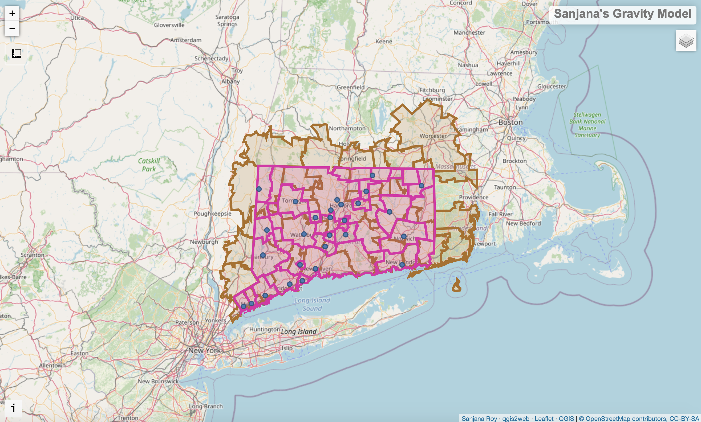
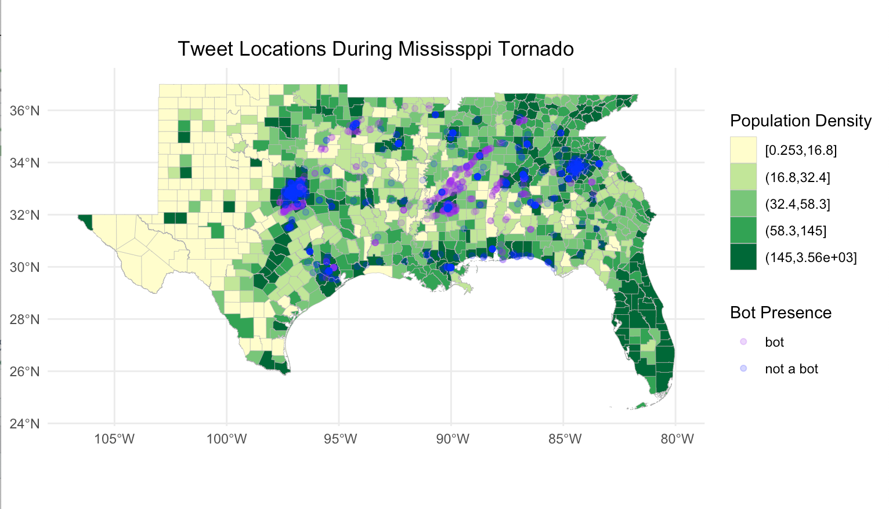

# GEOG 323: OpenSource GIScience | [Course Website](https://gis4dev.github.io)

Hi, my name is Sanjana and I'm an Architecture and Environmental Studies joint major and Biology minor at Middlebury College. As someone interested in how urban and natural environments correlate, I find GIS to be a very useful skill to develop. This website is a documentation of the projects I have done under the OpenSource GIScience course, and reflections on the material we are working with as well as wider questions in the open-source and GIS fields.

## Course Blog Posts

- [What is Open Source GIScience?](musings/open-source.md)
- [GIS as Reproducible Science](musings/GIScience-reproducibility.md)
- [Error and Uncertainty](musings/ErrorUncertainty.md)
- [Spatial Twitter Analysis](musings/SpatialTwitterAnalysis.md)
- [Humanitarian GIS](musings/HumanitarianGIS.md)
- [Reproducibility vs Ethics](musings/ReproducibilityEthics.md)

## GIScience Analyses

Click on any of the links below to view reports of the studies I conducted in this class:

### [Gravity Model of Spatial Interaction](gravity/gravity.md)

### [Replication of Rosgen Stream Classification](Rosgen/rosgen.md)

### [Riparian Trees and Flood Zones in Dar es Salaam](PostGISProject/RipBuffer.md)

### [Replication of Vulnerability Modeling for Sub-Saharan Africa](Malcomb/Malcomb.md)

### [Spatial-Temporal and Content Analysis of Twitter Data](Dorian/Dorian.md)

### [Replication of Spatial Accessibility of COVID-19 Health Resources](Kang/Kang.md)

